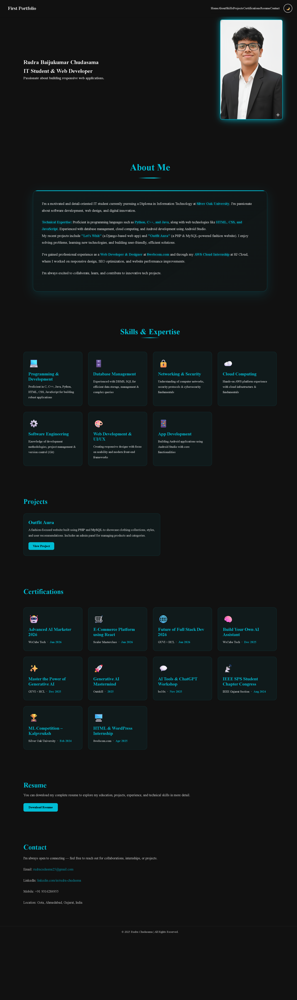

# 🌐 Rudra Resume — Personal Portfolio Website

> A modern, responsive personal portfolio and resume website built with vanilla HTML, CSS, and JavaScript.

🔗 **Live Demo:** [rudraresume.netlify.app](https://rudraresume.netlify.app)

---

## 📸 Preview



---

## ✨ Features

- 🌙 **Dark / Light Theme Toggle** — remembers your preference via `localStorage`
- 📱 **Fully Responsive** — works on mobile, tablet, and desktop
- 🎯 **Active Nav Link Detection** — highlights current section using Intersection Observer API
- 🎬 **GSAP Scroll Animations** — smooth entrance animations on every section as you scroll
- 🔒 **Code Protection** — right-click, inspect, and copy-paste disabled
- ⚡ **Smooth Scrolling** — powered by GSAP ScrollToPlugin with native fallback
- 📂 **Sections:** Home · About · Skills · Projects · Certifications · Resume · Contact

---

## 🛠️ Built With

| Technology | Usage |
|---|---|
| HTML5 | Structure & semantic markup |
| CSS3 | Styling, animations, dark/light theme via CSS variables |
| JavaScript (Vanilla) | Theme, nav, scroll, animations logic |
| [GSAP 3](https://greensock.com/gsap/) | Scroll-triggered entrance animations |
| [Google Fonts – Poppins](https://fonts.google.com/specimen/Poppins) | Typography |
| [Netlify](https://netlify.com) | Hosting & deployment |

---

## 📁 Project Structure

```
portfolio/
├── index.html          # Main HTML file
├── css/
│   └── style.css       # All styles (theme, layout, responsive)
├── js/
│   └── script.js       # Theme, nav, animations, scroll logic
├── img/
│   ├── pp.png          # Profile photo
│   ├── 2.png           # Favicon
│   └── Rudra_Resume.pdf  # Downloadable resume PDF
└── site.webmanifest    # PWA manifest
```

---

## 🎨 Design Highlights

- **Color Accent:** `#00bcd4` (Cyan) — used across headings, borders, hover effects
- **Dark Mode:** `#0d0d0d` background with `#f5f5f5` text
- **Light Mode:** `#ffffff` background with `#000000` text
- **CSS Variables** for instant theme switching without page reload
- **Glassmorphism-style** skill & certification cards with hover lift effects
- **Gradient underlines** on section headings for visual polish

---

## 🧩 Sections

### 🏠 Home
Intro with name, title, and profile photo with a glowing cyan border effect.

### 👤 About Me
Summary card with highlighted technical expertise and professional background.

### 💻 Skills & Expertise
Grid of skill cards covering Programming, Database, Networking, Cloud, Software Engineering, Web Dev/UI-UX, and App Development.

### 🚀 Projects
Project cards with live demo links. Currently featuring **Outfit Aura** — a PHP & MySQL fashion website.

### 🏆 Certifications
Grid display of 10 professional certifications from WsCube Tech, Scaler, GUVI × HCL, be10x, Outskill, IEEE, and Silver Oak University.

### 📄 Resume
One-click PDF resume download button.

### 📬 Contact
Email, LinkedIn, phone, and location details.

---

## ⚙️ JavaScript Architecture

The entire JS is wrapped in an **IIFE** `(() => { })()` to avoid polluting the global scope. It is split into focused modules:

```
initCodeProtection()   → Disables right-click, inspect, copy
initThemeSystem()      → Dark/light toggle with localStorage
initMobileMenu()       → Hamburger menu open/close + outside click close
initSmoothScroll()     → GSAP ScrollTo with native fallback
initActiveLinks()      → Intersection Observer for nav highlighting
initGSAPAnimations()   → All scroll-triggered entrance animations
```

---

## 🚀 Getting Started

### Clone the repo
```bash
git clone https://github.com/your-username/portfolio.git
cd portfolio
```

### Run locally
Just open `index.html` in your browser — no build tools or dependencies needed.

```bash
# Or use VS Code Live Server extension
# Or use Python's built-in server
python -m http.server 8000
```

Then visit `http://localhost:8000`

---

## 📦 Deploy to Netlify

1. Push your code to GitHub
2. Go to [netlify.com](https://netlify.com) → **Add new site** → **Import from Git**
3. Select your repo → click **Deploy**
4. Done! Your site is live 🎉

---

## 📜 License

This project is personal and not open for reuse or redistribution without permission.

© 2025 **Rudra Chudasama** — All Rights Reserved.

---

<div align="center">
  Made with ❤️ by <strong>Rudra Chudasama</strong> · Ahmedabad, Gujarat, India
</div>
